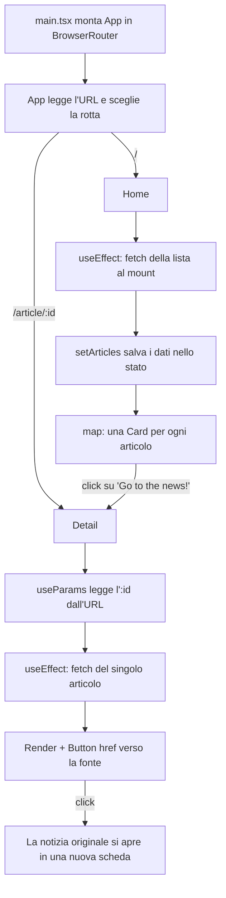

# SpaceFlight News — logica, flusso e funzionamento

App React + TypeScript (Vite) che mostra le notizie di [Spaceflight News API](https://api.spaceflightnewsapi.net/v4/articles/) in una griglia di card, con una pagina di dettaglio per ogni notizia.

## Struttura dei file

```
src/
├── main.tsx              punto di ingresso: monta App dentro BrowserRouter
├── App.tsx               navbar + definizione delle rotte
├── types.ts              tipi TypeScript della risposta API
├── App.css               stile custom (ritaglio immagini delle card)
├── components/
│   ├── Navbar.tsx        barra in alto, il nome riporta alla home
│   ├── Card.tsx          anteprima di una singola notizia
│   └── Button.tsx        bottone riusabile (link interno / esterno / normale)
└── pages/
    ├── Home.tsx          scarica la lista e la mostra in griglia
    └── Detail.tsx        scarica e mostra la singola notizia
```

La divisione è quella classica: in `components/` sta ciò che è riusabile e non sa nulla di
dove viene usato, in `pages/` sta ciò che corrisponde a una rotta e si occupa di caricare i dati.

## Il flusso, dall'avvio al click



### 1. Avvio

`main.tsx` importa il CSS di Bootstrap e monta `App` dentro `BrowserRouter`. Il router va
messo qui, sopra tutto, perché ogni componente che usa `Link` o `useParams` deve trovarsi
al suo interno.

### 2. Routing

`App.tsx` definisce due rotte più un fallback:

| URL             | Pagina   |
| --------------- | -------- |
| `/`             | `Home`   |
| `/article/:id`  | `Detail` |
| qualsiasi altro | messaggio "Pagina non trovata" |

La `Navbar` sta **fuori** da `<Routes>`: così resta visibile su ogni pagina invece di essere
rimontata a ogni cambio di rotta.

### 3. Caricamento dei dati

Home e Detail seguono lo stesso schema, con tre stati:

- `loading` — parte a `true`, mostra "Caricamento..."
- `error` — se la richiesta fallisce, mostra un messaggio rosso
- `articles` / `article` — i dati veri e propri

La fetch sta dentro `useEffect`, che decide **quando** rifarla in base all'array di dipendenze:

- `Home` usa `[]` → la fetch parte una sola volta, al mount.
- `Detail` usa `[id]` → la fetch si ripete se cambia l'`:id` nell'URL, perché lo stesso
  componente viene riusato per articoli diversi senza essere rimontato.

Il `finally` porta `loading` a `false` sia in caso di successo che di errore: senza,
un errore lascerebbe la pagina bloccata su "Caricamento..." per sempre.

### 4. Dalla lista al dettaglio

`Home` fa `.map()` sugli articoli e crea una `Card` per ognuno. La `key={article.id}`
serve a React per capire quali elementi sono cambiati quando la lista si aggiorna.

Ogni `Card` contiene un `Button` con `to={/article/${article.id}}`: l'id viaggia
nell'URL, e `Detail` lo rilegge con `useParams` per sapere cosa scaricare. È il motivo per
cui il link è condivisibile — l'informazione sta nell'URL, non in memoria.

### 5. Il componente Button

Un solo componente copre tre casi, scelti in base alle props:

| Prop passata | Cosa produce | Quando si usa |
| ------------ | ------------ | ------------- |
| `to`         | `<Link>` di react-router | navigazione interna, senza ricaricare la pagina |
| `href`       | `<a target="_blank">` | link esterno, apre in una nuova scheda |
| nessuna      | `<button>` | azione senza navigazione |

Il controllo avviene con due `if` e un `return` anticipato, non con annidamenti.

Sul link esterno c'è `rel="noopener noreferrer"`: senza, la pagina aperta potrebbe accedere
a `window.opener` e manipolare quella di origine. Con `target="_blank"` va sempre messo.

## L'API

Endpoint base: `https://api.spaceflightnewsapi.net/v4/articles/`

- **Lista** — `?limit=12`. Restituisce `{ count, next, previous, results: [...] }`,
  quindi gli articoli sono in `data.results`, non nella radice.
- **Dettaglio** — `/{id}/`. Restituisce l'articolo direttamente.
  Lo **slash finale è necessario**: senza, l'API risponde `301` e il browser deve seguire
  un redirect in più.

Campi usati: `id`, `title`, `url` (la fonte originale), `image_url`, `news_site`,
`summary`, `published_at` (stringa ISO, convertita in ora locale con `new Date(...)`).

## Note di stile

Le immagini dell'API hanno proporzioni diverse tra loro. La classe `.article-img` in
`App.css` impone `height: 180px` e `object-fit: cover`: ritaglia invece di deformare, e
tiene le card allineate. Il resto dello stile è Bootstrap: `h-100` sulle card e `mt-auto`
sul bottone fanno sì che tutte le card di una riga abbiano la stessa altezza e i bottoni
restino in fondo.

## Possibile miglioramento

La logica di fetch è quasi identica tra `Home` e `Detail`. Un hook `useFetch<T>(url)` che
restituisca `{ data, loading, error }` toglierebbe la ripetizione. Con due sole pagine
sarebbe un'astrazione prematura; conviene farlo quando si aggiunge la terza chiamata
all'API.

## Comandi

```bash
npm install     # installa le dipendenze
npm run dev     # avvia in sviluppo su http://localhost:5173
npm run build   # typecheck + build di produzione
npm run lint    # ESLint
```
